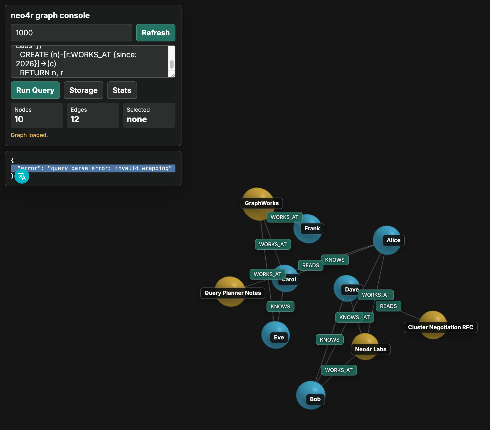

# neo4r

`neo4r` is an experimental Rust property graph database. The current cluster
path uses a Raft-backed shard replication path for server cluster mode, with
static routing primaries during bootstrap.

The first milestone is intentionally small:

- in-memory property graph
- deterministic write commands
- state machine apply path
- adjacency-list traversal
- snapshot-friendly graph state

The target cluster layer is a Raft-style replicated state machine that
replicates `Command` values and applies them to `GraphState` in the same
committed order on every node.

```text
client -> leader -> raft log -> followers -> GraphState::apply(command)
```

The implementation now persists Raft term/voted-for, handles RequestVote and
AppendEntries over the replication port, performs AppendEntries log consistency
checks, repairs divergent suffixes in the RaftCore, records follower match
indexes, tracks follower leader-contact timestamps to suppress unnecessary
elections, runs jittered election rounds that collect peer RequestVote responses
and promote candidates after quorum, and applies graph state only after the Raft
commit index advances. Strong reads in Raft mode use a local leader lease when
available and fall back to quorum-confirmed read-index validation, and routing
membership changes pass through a joint quorum model in RaftCore. Routing table
installs also append a durable `ClusterConfigChange` command to the shard log.
The remaining limitations are production-grade lease clock-bound validation and
fully applying replicated configuration-change commands as cluster metadata
state transitions.

Replay is shard-local, not cluster-global. A node only replays log entries for
shards it hosts.

```text
data/
  shards/
    0/
      command.log
    2/
      command.log
```

Replication ACKs are also shard-position based. A replica responds with each
applied `(shard_id, log_index)` for the received batch, and the primary requires
an exact entry ACK before counting that replica toward the write policy. Those
positions are also used for cluster status `match_indexes`.

The initial sharding policy is intentionally simple:

- node owner: `node_id % shard_count`
- relationship owner: owner shard of the `from` node
- boundary node copies are read-only cache data, not write authorities

Shard-local graph state can also keep boundary node copies. These copies store
the next node's selected labels/properties so cross-shard outgoing traversals can
filter and return common target fields without immediately fetching the owner
shard.

```text
local node -> local relationship -> boundary node cache
```

The current in-memory graph state maintains secondary indexes for common read
paths:

- label to node ids
- `(label, property, value)` to node ids
- `(node_id, relationship type)` to outgoing relationship ids
- `(node_id, relationship type)` to incoming relationship ids
- `(label, property, value)` to boundary node ids

Each hosted shard has two local recovery files:

- `command.log`: append-only committed command entries
- `snapshot.bin`: compact graph state at a committed `(term, index)`

Snapshots are written through a temporary file and atomically renamed into place.

Storage has a separate key-value abstraction for query lookup paths. Tests use
`MemoryKvStore`, and the disk backend is `RocksKvStore`, a small wrapper around
the system RocksDB C API. Logical graph commands are applied through a key-value
write batch so node/relationship records and secondary index updates are written
atomically by RocksDB. The graph store also exposes invariant verification and
index repair helpers for materialized label/property/adjacency indexes.

Current graph key families:

- `n/{node_id}`: node record
- `r/{relationship_id}`: relationship record
- `out/{node_id}/{relationship_id}`: outgoing adjacency
- `outt/{node_id}/{relationship_type}/{relationship_id}`: typed outgoing adjacency
- `in/{node_id}/{relationship_id}`: incoming adjacency
- `int/{node_id}/{relationship_type}/{relationship_id}`: typed incoming adjacency
- `l/{label}/{node_id}`: label index
- `lp/{label}/{property}/{value}/{node_id}`: label-property index
- `bn/{node_id}`: boundary node record
- `blp/{label}/{property}/{value}/{node_id}`: boundary label-property index

Query execution is behind a `QueryEngine` trait so other engines can be added
without changing storage or cluster code. The first implementation is a small
Cypher-oriented engine.

Currently supported query subset:

```cypher
MATCH (n) RETURN n
MATCH (n:Label) WHERE n.property = "value" RETURN n
MATCH (n:Label) WHERE n.property = "value" RETURN n.property
MATCH (n:Label) WHERE n.property = "value" AND n.other = 1 RETURN n
MATCH (n:Label) WHERE n.score >= 10 AND n.status <> "archived" RETURN n
MATCH (n:Label) WHERE n.status = "active" OR n.score >= 100 RETURN n
MATCH (n:Label) WHERE (n.status = "active" OR n.score >= 100) AND n.deleted = false RETURN n
MATCH (n:Label) WHERE n.optional IS NULL RETURN n
MATCH (n:Label) WHERE n.required IS NOT NULL RETURN n
MATCH (n:Label) RETURN n.property ORDER BY n.other DESC SKIP 10 LIMIT 20
MATCH (n:Label) RETURN DISTINCT n.property ORDER BY n.property ASC
MATCH (n:Label) WHERE n.property = "value" RETURN count(n)
MATCH (n:Label) RETURN n.property, count(n) ORDER BY count(n) DESC
MATCH (a:Label)-[:TYPE]->(b:Label) WHERE a.property = "value" RETURN b
MATCH (a:Label)-[:TYPE]->(b:Label) WHERE b.property = "value" RETURN a.property, b.property
MATCH (a:Label)-[r:TYPE]->(b:Label) RETURN b.property ORDER BY r.weight ASC LIMIT 10
MATCH (a:Label)-[r:TYPE]->(b:Label) RETURN count(r)
MATCH (n:Label) WHERE vector.knn(n.embedding, [1.0, 0.0], 10) RETURN n
CREATE (n:Label {property: $value}) RETURN n
CREATE (:Label {property: $value})
CREATE (n:Label {property: $value}) SET n.other = $other RETURN n.other
CREATE (n:Label {property: $value}) SET n += {other: $other, active: true} RETURN n
CREATE (n:Label {property: $value}) WITH n MATCH (m:OtherLabel {id: $id}) CREATE (n)-[r:TYPE]->(m) RETURN n, r
MERGE (n:Label {property: $value}) RETURN n
MERGE (:Label {property: $value})
MERGE (n:Label {id: $id}) ON CREATE SET n.created = $created ON MATCH SET n.seen = $seen RETURN n
MATCH (a:Label {id: $from}), (b:Label {id: $to}) CREATE (a)-[r:TYPE {property: $value}]->(b) RETURN r
MATCH (a:Label {id: $from}), (b:Label {id: $to}) CREATE (a)-[r:TYPE]->(b) SET r.property = $value RETURN r.property
MATCH (a:Label {id: $from}), (b:Label {id: $to}) CREATE (a)-[:TYPE]->(b)
MATCH (a:Label {id: $from}), (b:Label {id: $to}) CREATE (a)-[:TYPE {property: $value}]->(b)
MATCH (a:Label) WHERE a.id = $from MATCH (b:Label) WHERE b.id = $to MERGE (a)-[r:TYPE {property: $value}]->(b) RETURN r
MATCH (a:Label) WHERE a.id = $from MATCH (b:Label) WHERE b.id = $to MERGE (a)-[r:TYPE {property: $value}]->(b) ON CREATE SET r.created = $created ON MATCH SET r.seen = $seen RETURN r
MATCH (a:Label) WHERE a.id = $from MATCH (b:Label) WHERE b.id = $to MERGE (a)-[:TYPE]->(b)
MATCH (a:Label) WHERE a.id = $from MATCH (b:Label) WHERE b.id = $to MERGE (a)-[:TYPE {property: $value}]->(b)
CREATE CONSTRAINT constraint_name FOR (n:Label) REQUIRE n.property IS UNIQUE
CREATE INDEX index_name IF NOT EXISTS FOR (n:Label) ON (n.property)
CREATE VECTOR INDEX vector_name IF NOT EXISTS ON :Label(embedding) DIMENSIONS 2 METRIC cosine
REBUILD VECTOR INDEX vector_name
SHOW INDEXES
SHOW INDEX index_name
SHOW VECTOR INDEXES
SHOW VECTOR INDEX vector_name
SHOW VECTOR INDEX STATUS
SHOW VECTOR INDEX STATUS vector_name
SHOW CONSTRAINTS
SHOW CONSTRAINT constraint_name
DROP CONSTRAINT constraint_name
DROP INDEX index_name IF EXISTS
DROP CONSTRAINT constraint_name IF EXISTS
MATCH (n:Label) WHERE n.id = $id SET n.property = $value, n.other = $other RETURN n
MATCH (n:Label) WHERE n.id = $id SET n.property = $value RETURN n.property, n.other
MATCH (n:Label) WHERE n.id = $id SET n.property = null RETURN n.property
MATCH (n:Label) WHERE n.id = $id SET n += {property: $value, other: $other} RETURN n
MATCH (n:Label) WHERE n.id = $id SET n = {property: $value, other: $other} RETURN n
MATCH (n:Label) WHERE n.id = $id SET n:OtherLabel RETURN n
MATCH (n:Label) WHERE n.id = $id REMOVE n.property, n.other RETURN n.property
MATCH (n:Label) WHERE n.id = $id REMOVE n:OtherLabel RETURN n
MATCH (n:Label) WHERE n.id = $id DELETE n RETURN n
MATCH (a:Label)-[r:TYPE {property: $value}]->(b:Label) SET r.other = $other, r.weight = $weight RETURN r
MATCH (a:Label)-[r:TYPE {property: $value}]->(b:Label) SET r.other = null RETURN r.other
MATCH (a:Label)-[r:TYPE {property: $value}]->(b:Label) SET r += {other: $other, weight: $weight} RETURN r
MATCH (a:Label)-[r:TYPE {property: $value}]->(b:Label) SET r = {other: $other, weight: $weight} RETURN r
MATCH (a:Label)-[r:TYPE {property: $value}]->(b:Label) REMOVE r.other, r.weight RETURN r.other
MATCH (a:Label)-[r:TYPE {property: $value}]->(b:Label) DELETE r RETURN r.property
```

`query_plan` reports the distributed route plus the selected read access path,
including node unique-index seek, node property-index seek, label scan, full
scan, vector index seek, and relationship type scan.
Vector indexes are catalog-backed and rebuilt into HNSW caches on open; indexed
vector properties must be vectors with the declared dimension before the write
is appended to the WAL. Replicated batches are validated as a unit before a
replica appends them locally, including intra-batch node property changes.
`SHOW VECTOR INDEX STATUS` exposes the rebuilt HNSW cache entry count through
Cypher.

The first backend layer is a TCP daemon crate:

```bash
cargo run -p neo4r-server -- --bind 127.0.0.1:7687 --data-dir ./data --shards 4 --partitions 2
```

The server can also expose a browser console with a 3D graph viewer:

```bash
cargo run -p neo4r-server -- --bind 127.0.0.1:7687 --web-bind 127.0.0.1:7474 --data-dir ./data --shards 4 --partitions 2
```

Open `http://127.0.0.1:7474/` to inspect nodes and relationships in a Three.js
scene. Add `--web-auth-token TOKEN` to require `Authorization: Bearer TOKEN`
or `?token=TOKEN` on web/API requests. The browser console also has a login
token field that stores the bearer token in local storage for subsequent API
calls. Bootstrap tokens may be prefixed with
`reader:`, `writer:`, or `admin:`; an unprefixed bootstrap token is treated as
admin. Admin users can manage persistent RocksDB-backed web users under
`DATA_DIR/system/web-auth-rocksdb`; each user may have multiple named tokens with
`expired_at` unix-second expiry (`0` means no expiry). Tokens can also be scoped
to database roles, for example `database_roles:"tenant_a=writer,tenant_b=reader"`.
Expired, revoked, or non-authorized database tokens cannot authorize requests.
The server exposes multi-tenant databases under `DATA_DIR/databases/{name}` and
system metadata under `DATA_DIR/system`.
The existing root data directory remains the `default` database for compatibility.
HTTP clients select a database with `X-Neo4r-Database`, `?db=name`, or a JSON
`"database":"name"` field. Query APIs also accept a leading `USE database_name`
or ``USE `database_name`;`` clause; the clause selects the database for that
request and is stripped before the query is planned or executed.
`--slow-query-threshold-ms MS` controls the in-memory slow query log threshold.
The web console also exposes JSON endpoints for automation and external tools:



See [docs/operations.md](docs/operations.md) for local cluster bootstrap,
snapshot backup/restore, tenant auth, and recovery checks. See
[docs/read_consistency.md](docs/read_consistency.md) for the read freshness
contract.

Additional operator and contributor contracts:

- [Replication boundary](docs/replication_boundary.md)
- [Architecture layers](docs/architecture_layers.md)
- [Atomic apply audit](docs/atomic_apply_audit.md)
- [Fault injection matrix](docs/fault_injection_matrix.md)
- [API compatibility](docs/api_compatibility.md)
- [Security notes](docs/security.md)
- [Backup/restore contract](docs/backup_restore.md)

```text
GET  /api/graph?limit=1000
GET  /api/examples
POST /api/query
POST /api/query-plan
POST /api/profile
GET  /api/metrics
GET  /api/slow-queries
GET  /api/statistics
GET  /api/storage
GET  /api/metadata-log
GET  /api/cluster
GET  /api/database
GET  /api/admin/users
GET  /api/admin/databases
POST /api/use-database
POST /api/admin/users
POST /api/admin/databases
POST /api/admin/disable-database
POST /api/admin/enable-database
POST /api/admin/delete-database
POST /api/admin/invoke-token
POST /api/admin/revoke-token
POST /api/admin/cleanup-expired-tokens
POST /api/admin/delete-user
POST /api/cluster/plan-rebalance
POST /api/cluster/advance-rebalance
POST /api/backup
POST /api/restore
```

`POST /api/query`, `/api/query-plan`, and `/api/profile` accept a JSON body like
`{"query":"MATCH (n:Person) WHERE n.name = $name RETURN n","params":{"name":"Alice"}}`.
For tenant selection, include `"database":"tenant_a"` or send
`X-Neo4r-Database: tenant_a`, or write
`{"query":"USE tenant_a MATCH (n) RETURN n"}`. `GET /api/database?db=tenant_a`
and `POST /api/use-database` with `{"database":"tenant_a"}` validate the selected
database and return `{"database":"tenant_a"}`. `POST /api/admin/databases`
accepts `{"name":"tenant_a"}`.
`POST /api/admin/invoke-token` accepts
`{"name":"operator","token_id":"main","role":"writer","token":"writer:operator-token","expired_at":"0"}`.
Backup and restore requests accept `{"path":"/path/to/backup"}`. Snapshot
maintenance responses include a versioned safety manifest with shard, term,
index, byte size, and checksum fields. Restore copies files into the live data
directory, so it is intended for local development and controlled maintenance
windows.

The default wire protocol is a native length-prefixed frame:

```text
magic(4) version(1) type(1) flags(2) length(4) request_id(8) payload(length)
```

Current request message types:

- `1`: ping
- `2`: quit
- `3`: query, with Cypher payload
- `4`: command, with tab-separated command payload
- `5`: fetch cursor page, with `cursor_id` or `cursor_id	page_size`
- `6`: close cursor, with `cursor_id`
- `7`: cancel queued request, with target `request_id`

Responses carry the same `request_id`, so clients can send multiple requests on
one connection and correlate responses asynchronously. `CANCEL` is handled by the
session reader before it enters the worker queue; it can cancel requests that are
still queued and reports `CANCEL_MISSED` once a request is already running,
completed, or unknown.

The server does not spawn a new OS thread for every request. Each accepted TCP
connection owns a session reader and response writer, while query/command
execution is submitted to a bounded worker pool. The pool size and queue depth
are configurable:

```bash
cargo run -p neo4r-server -- --workers 8 --queue-capacity 4096
```

## SDKs

The native protocol codec is shared by the server and Rust SDK through
`neo4r-protocol`, so frame, query payload, result row, and cursor response
encoding stay in one place.

Rust SDK:

```rust
use neo4r_client::{Client, QueryParams, QueryValue, Value};

let mut client = Client::connect("127.0.0.1:7687")?;
let mut params = QueryParams::new();
params.insert("name".to_string(), Value::String("Alice".to_string()));
let rows = client.execute_with_params(
    "CREATE (n:Person {name: $name}) RETURN n.name",
    &params,
)?;
assert_eq!(
    rows[0].get("n.name"),
    Some(&QueryValue::Scalar(Value::String("Alice".to_string())))
);
let plan = client.query_plan("MATCH (n:Person) RETURN n", &QueryParams::new())?;
let cluster = client.cluster_status()?;
client.close()?;
```

Run the Rust SDK example after starting a local server:

```bash
cargo run -p neo4r-server -- --bind 127.0.0.1:17687 --data-dir /tmp/neo4r-rust-sdk-example --shards 1 --partitions 1
cargo run -p neo4r-client --example basic_usage -- 127.0.0.1:17687
```

Python SDK:

```python
from neo4r_client import Client

client = Client.connect("127.0.0.1", 7687)
rows = client.execute(
    "CREATE (n:Person {name: $name}) RETURN n.name",
    {"name": "Alice"},
)
plan = client.query_plan("MATCH (n:Person) RETURN n", {})
cluster = client.cluster_status()
client.close()
```

SDK tests can be run independently:

```bash
cargo test -p neo4r-protocol -p neo4r-client
PYTHONPATH=sdks/python python3 -m unittest discover -s sdks/python/tests -v
```

Command payloads currently reuse the initial tab-separated command format:

```text
CREATE_NODE	Person	name=s:alice	age=i:42
ADD_NODE_LABEL	7	Employee
REMOVE_NODE_LABEL	7	Person
REMOVE_NODE_PROPERTY	7	status
REMOVE_RELATIONSHIP_PROPERTY	9	weight
CREATE_INDEX	person_name	Person	name	IF_NOT_EXISTS
CREATE_CONSTRAINT	person_email_unique	Person	email	IF_NOT_EXISTS
CREATE_VECTOR_INDEX	doc_embedding	Document	embedding	2	cosine	IF_NOT_EXISTS
REBUILD_VECTOR_INDEX	doc_embedding
DROP_INDEX	person_name	IF_EXISTS
DROP_CONSTRAINT	person_email_unique	IF_EXISTS
QUERY_PLAN	MATCH (n:Person) RETURN n
PROFILE	MATCH (n:Person) RETURN n
STORAGE_STATUS
STATISTICS
CHECKPOINT_NOW
COMPACT_STORAGE
METADATA_LOG
BEGIN_TX	READ_WRITE
BEGIN_TX	READ_WRITE READ_COMMITTED
TX_QUERY	1	CREATE (n:Person {name: $name}) RETURN n	name=s:alice
TX_QUERY_PLAN	1	MATCH (n:Person) RETURN n
TX_STATUS	1
LIST_ALL_TX
KILL_TX	1
TX_PREPARED_QUERY_ROUTE	1	2	name=s:alice
COMMIT_TX	1
TX_PREPARED_STATUS	1
LIST_PREPARED_TX
LIST_TX_DECISIONS
RECOVER_TX_DECISIONS
VECTOR_INDEX_STATUS
VECTOR_INDEX_STATUS	doc_embedding
REGISTER_REPLICATION_PEER	2	127.0.0.1:17687
REPLICATION_PEER_STATUS
REPLICATION_PEER_STATUS	2
REPLICATION_STATUS
JOIN_REQUEST	2	127.0.0.1:7688	1	1	4
JOIN_ACCEPT	2
JOIN_REJECT	2	version_mismatch
REGISTER_NODE	2	127.0.0.1:7688
DECOMMISSION_NODE	2
LIST_NODES
METADATA_AUTHORITY
SET_METADATA_AUTHORITY	1
SET_REBALANCE_POLICY	2	128
PLAN_REBALANCE
START_REBALANCE
REBALANCE_STATUS
ADVANCE_REBALANCE
CANCEL_REBALANCE
CLUSTER_MANAGEMENT_STATUS
PREPARE_REBALANCE_STEP	ADD_REPLICA	0	2
MARK_SHARD_CAUGHT_UP	0	2	42
APPLY_REBALANCE_STEP	ADD_REPLICA	0	2
APPLY_REBALANCE_STEP	TRANSFER_PRIMARY	0	1	2
APPLY_REBALANCE_STEP	REMOVE_REPLICA	0	1
CATCH_UP_FROM_PRIMARIES
CATCH_UP_FROM_PRIMARIES	1024
CATCH_UP_FROM_PRIMARY	1
CATCH_UP_FROM_PRIMARY	1	1024
CATCH_UP_PLAN
CATCH_UP_PLAN_PRIMARY	1
```

When the daemon is started through `neo4r-server`, query peers and replication
peers registered through backend commands are persisted under `cluster/` in the
data directory and reloaded on restart.

Typed property prefixes are `n:`, `b:true`, `i:42`, `f:3.14`, `s:text`,
`v:1.0,0.0`, and `m:<hex-encoded-properties>` for query parameter maps. Map
values are request parameter containers only; stored graph properties must be
scalar or vector values, so nested map property writes are rejected before WAL
append.
`BEGIN_TX` replies with `OK	TX_BEGIN	tx_id	mode	isolation`.
`TX_STATUS` replies with `OK	TX_STATUS	tx_id	mode	isolation	staged_writes`.
`LIST_ALL_TX` replies with
`OK	TX_LIST_ALL	count	session_id:tx_id:mode:isolation:staged_writes,...`.
`KILL_TX` closes a transaction by id across sessions and replies with
`OK	TX_KILL	tx_id	session_id`.
`TX_PREPARED_STATUS` replies with
`OK	TX_PREPARED_STATUS	prepared_id	shard_id	write_count`.
`LIST_PREPARED_TX` replies with `OK	TX_PREPARED_LIST	count	id:shard_id:write_count,...`.
`LIST_TX_DECISIONS` lists durable commit/abort decisions that still need replay
and replies with `OK	TX_DECISIONS	count=N entries=...`.
`RECOVER_TX_DECISIONS` reapplies durable commit/abort decisions for prepared
participants and replies with `OK	TX_RECOVERY	count`.
`neo4r-server --recover-transactions-on-startup` runs the same decision replay
before accepting client traffic. `--recover-transactions-interval-ms MS` keeps
running it periodically while the daemon is serving traffic, which lets a node
finish prepared participants after delayed commit/abort decisions arrive.
`REPLICATION_PEER_STATUS` replies with each remote server's registered address
and routing-table roles:
`OK	REPLICATION_PEER_STATUS	server=S address=A|missing primary_shards=... replica_shards=...`.
`REPLICATION_STATUS` includes each shard's primary, replicas, local committed
index, observed replica match indexes, and derived replica lag. Replica lag is
reported as `server_id:entries_behind` or `server_id:unknown` until an exact ACK
or catch-up observation is available.
`QUERY_PLAN` includes the selected access path plus estimated cost, estimated
rows, and remote shard count. `PROFILE` executes the query and reports planning
time, execution time, returned rows, estimated scanned rows, index count,
read-cache and index-cache hit/miss deltas, and a compact operator tree with
estimated and actual rows per operator. `STATISTICS` reports the persisted
statistics catalog built from the local graph store, including label and
relationship type cardinality. `STORAGE_STATUS` reports data-dir file counts,
observed bytes, WAL segments, checkpoint files, metadata files, committed
indexes, WAL prune position, and read/index-cache counters. `CHECKPOINT_NOW`
writes explicit checkpoints for committed shard positions. `COMPACT_STORAGE` is
currently a safe maintenance hook that clears the read path cache, records the
WAL prune position, and reports observed storage size; backend-specific
compaction can be wired behind the same command later. `METADATA_LOG` returns the
durable metadata operation log for membership, routing, authority, and rebalance
metadata changes.
`JOIN_REQUEST` starts node admission negotiation and records protocol version,
storage version, and the node's expected shard count. A compatible request is
stored as `negotiating`; incompatible requests are stored as `rejected` with a
reason. `JOIN_ACCEPT` moves a negotiating node to `joining`, while
`JOIN_REJECT` records an explicit rejection. `REGISTER_NODE` remains as a
legacy shortcut that persists a node directly as `joining`. `DECOMMISSION_NODE`
marks a node as `draining` while it still owns shard placements and as `removed`
once it owns none. `LIST_NODES` returns the durable membership and shard
assignment view. Cluster metadata mutations are guarded by the local metadata
authority recorded in `cluster/metadata-authority.txt`; non-authority nodes
reject membership, routing, and rebalance metadata changes. `SET_REBALANCE_POLICY`
sets the replication factor and max step count used by plan generation.
`PLAN_REBALANCE` emits explicit shard placement steps for joining or draining
nodes and persists the latest proposed plan under `cluster/rebalance-plan.txt`.
`START_REBALANCE`, `ADVANCE_REBALANCE`, `REBALANCE_STATUS`, and
`CANCEL_REBALANCE` manage a durable execution state stored in
`cluster/rebalance-execution.txt`. `ADVANCE_REBALANCE` prepares replica
additions, observes match indexes, marks assignments caught up when possible,
and applies ready steps. `PREPARE_REBALANCE_STEP ADD_REPLICA` records a shard
assignment as `catching_up`; operators can still run the existing catch-up
transport and call `MARK_SHARD_CAUGHT_UP` with the replica's match index before
`APPLY_REBALANCE_STEP ADD_REPLICA` installs a new routing table version. A
replica must be caught up to at least the shard's committed index before it can
be added or used as a prepared primary transfer target. Replica removal refuses
to remove the current primary or the last remaining replica. Routing-table
updates advance the persisted config epoch, and local writes reject stale epoch
state before appending to the WAL. `CLUSTER_MANAGEMENT_STATUS` returns a
structured status payload containing metadata, membership, plan, execution, and
routing version. Native command dispatch exposes the same structured management
responses for profile, storage status, statistics, metadata log, and cluster
management status.
`CATCH_UP_FROM_PRIMARIES` replies with `start`, `end`, and `fetched` for each
replica shard. When `fetched=0`, `end` is `start - 1`, meaning no new log range
was applied.
`CATCH_UP_FROM_PRIMARY server_id` catches up only replica shards whose primary
is the requested server. An optional second field limits entries per TCP
request.
`CATCH_UP_PLAN` replies with
`OK	CATCH_UP_PLAN	shard=N primary=S start=I peer=registered|missing,...` without
opening replication TCP connections. `CATCH_UP_PLAN_PRIMARY server_id` filters
the plan to one primary.
`neo4r-server --replication-connect-timeout-ms MS` controls the TCP connect
timeout used by live write replication and replica catch-up pulls. This bounds
write or catch-up latency when a peer is unreachable; retry count and backoff
for live replication are still controlled by `--replication-retry-attempts` and
`--replication-retry-backoff-ms`.
`neo4r-server --catch-up-interval-ms MS` starts a background replica pull loop
that periodically runs the same primary catch-up transport while the daemon is
serving client traffic. `--catch-up-batch-size N` limits each startup or
periodic catch-up request to at most `N` log entries per shard.
`neo4r-server --sync-index-catalog-on-startup` pulls the catalog from the
metadata primary during startup, and `--sync-index-catalog-interval-ms MS`
keeps polling that metadata primary while the daemon is running. The metadata
primary must be registered as a query peer.
`TX_QUERY_PLAN` returns the committed query route/access path plus transaction
context (`tx_mode`, `tx_isolation`, `staged_writes`, and `staged_overlay`) so
clients can tell whether a read-write transaction has pending writes that are
not represented in the committed snapshot plan. `LIST_TX` entries use
`tx_id:mode:isolation:staged_writes` and only include the current session.
Read-only `SNAPSHOT` transactions keep one stable view for the transaction;
read-only `READ_COMMITTED` transactions take a fresh committed snapshot for each
`TX_QUERY`.
Read-write transactions stage writes until `COMMIT_TX`. Local read `TX_QUERY`
uses a read-your-writes overlay for staged node and relationship `CREATE`,
`MERGE`, property `SET` and `REMOVE`, and `DELETE` writes. Single-local-shard
read-write commits lower the staged overlay to real log commands so staged
creates can be matched, merged, updated, related, or deleted before commit.
Assigning `null` with property `SET` or inside `SET +=`/replacement maps removes
the property instead of storing a null property value.
Distributed read-your-writes combines local staged writes with remote shard
reads by sending an internal staged read batch to remote query peers; those
remote reads apply the staged overlay without appending it to the WAL.
Read-write transaction commit can group conditional `MATCH ... SET` and
`MATCH ... REMOVE` mutations across local and remote primary shards through the
native prepare/commit commands. Prepared participants commit through the same
staged overlay lowering path used by single-shard transactions, so mixed
`CREATE`, `MERGE`, `SET`, `REMOVE`, and `DELETE` batches can preserve
read-your-writes semantics per shard.
`--daemonize` starts the server as a detached child process and prints the child
PID.

## Data correctness tests

Data correctness tests are kept in a separate integration target so they can be
run independently from the full workspace suite:

```bash
cargo test -p neo4r-db --test data_correctness
```

This target exercises bulk node insertion, property updates/removals, deletes,
relationship mutation, detach delete, query result checks, and reopen recovery
with more than 1000 explicit correctness checks.
